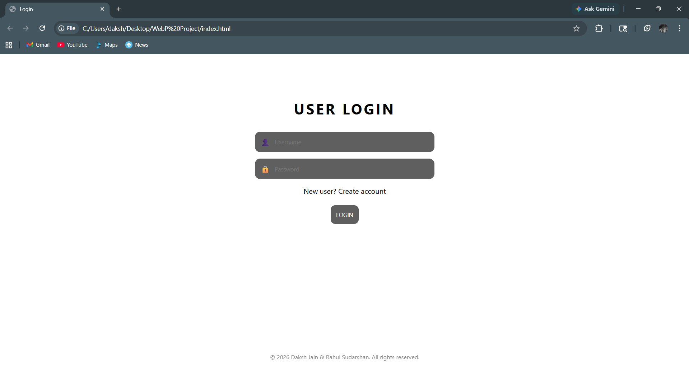
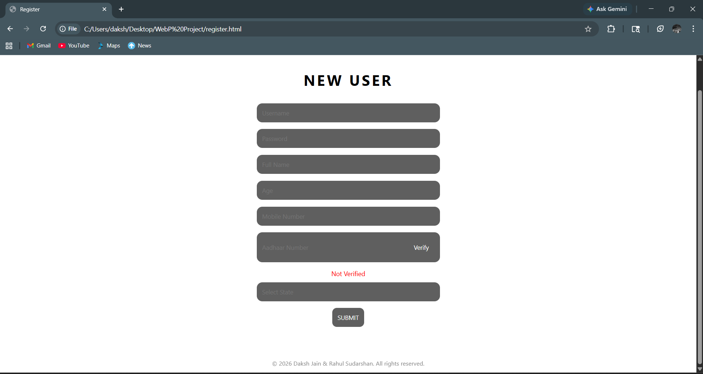
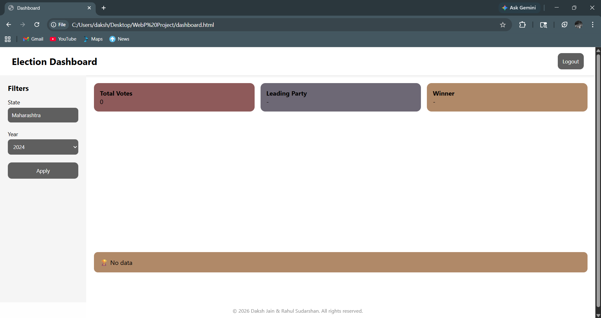
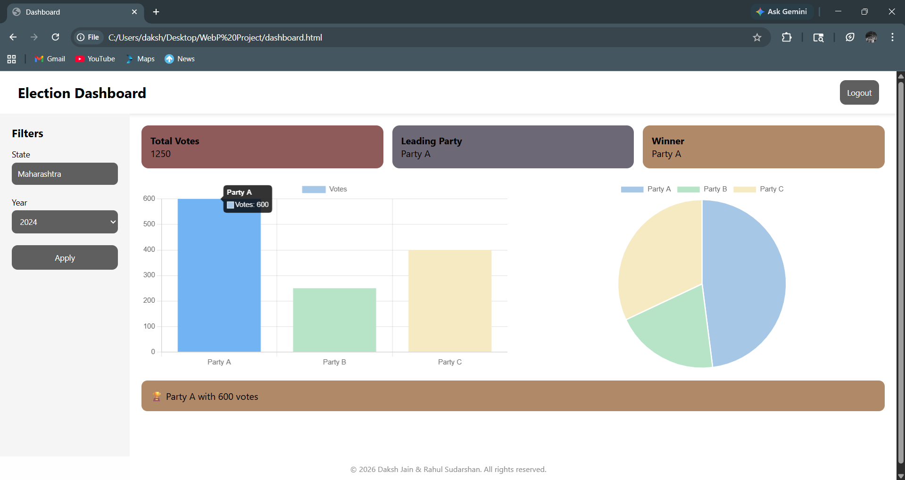

# 🗳️ Smart Election Result Analytics Dashboard

A web-based dashboard to visualize election results using interactive charts.

---

## 🚀 Live Demo
👉 https://daksh2405.github.io/Smart-Election-Dashboard/

---

## 📌 Features
- User Login & Registration
- Aadhaar Verification (12-digit validation)
- State-based filtering
- Interactive Bar Chart (Votes per Party)
- Pie Chart (Vote Share)
- Winner Highlight Section

---

## 🛠️ Technologies Used
- HTML
- CSS
- JavaScript
- Chart.js

---

## 📊 How It Works
1. User registers and verifies Aadhaar
2. Logs into the system
3. Dashboard loads
4. User selects state
5. Charts update dynamically

---

## 📸 Screenshots

### 🔐 Login Page

### 📝 Register Page

### 📊 Dashboard

---

## 👨‍💻 Authors
- Daksh Jain  
- Rahul Sudarshan
